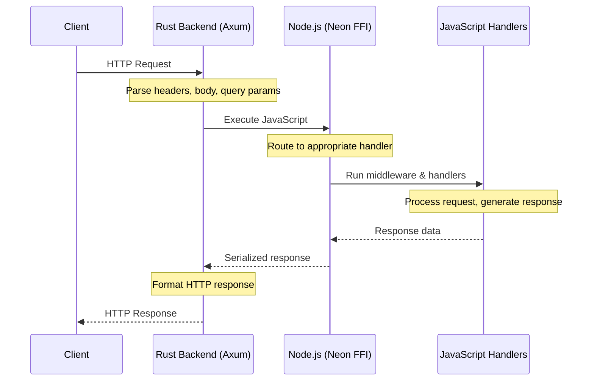
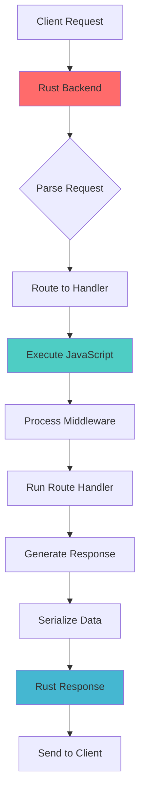
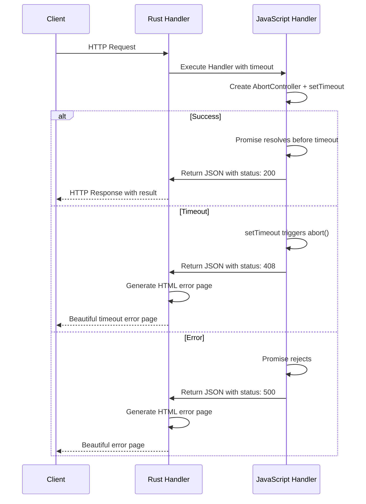

[](https://github.com/s00d/rnode-server)
[](https://github.com/s00d/rnode-server/blob/main/LICENSE)
[](https://github.com/s00d/rnode-server/releases)
[](https://github.com/s00d/rnode-server/releases)
[](https://github.com/s00d/rnode-server/issues)
[](https://github.com/s00d/rnode-server/stargazers)
[](https://www.rust-lang.org/)
[](https://nodejs.org/)
[](https://www.typescriptlang.org/)
[](https://www.npmjs.com/package/rnode-server)
[](https://www.donationalerts.com/r/s00d88)

# RNode Server


> **🚀 Experimental Project**: This is an experimental attempt to create a high-performance Node.js server built with Rust, featuring Express-like API with advanced middleware support.

## 🎯 **Project Overview**

RNode Server is **not just another Express.js alternative** - it's a **full-featured server implementation** built from the ground up with Rust and Node.js bindings. The goal is to create a production-ready server with all the necessary configurations for fast deployment and optimal performance.

### 🔬 **Why This Experiment?**

- **Performance**: Leverage Rust's speed and memory safety for HTTP handling
- **Node.js Integration**: Maintain familiar JavaScript/TypeScript API
- **Full Control**: Custom implementation of all server features
- **Modern Architecture**: Built with modern async patterns and efficient data structures

## ⚡ **Performance Comparison**

> **Note**: Performance tests were conducted on a personal laptop. Results may vary depending on server configuration, hardware, and environment.

| Metric                   | Express (`:4547/hello`) | RNode Server (`:4546/hello`) | Difference                          |
|--------------------------|-------------------------|------------------------------|-------------------------------------|
| **Requests/sec (RPS)**   | 9,315                   | 25,378                       | **~2.7× faster**                    |
| **Average time/request** | 10.7 ms                 | 3.9 ms                       | **~2.7× faster**                    |
| **p50 (median)**         | 10 ms                   | 4 ms                         | **~2.5× faster**                    |
| **p95**                  | 14 ms                   | 7 ms                         | **~2× faster**                      |
| **Maximum (max)**        | 18 ms                   | 13 ms                        | **Shorter tail**                    |
| **Transfer rate**        | 3.3 MB/s                | 6.6 MB/s                     | **~2× higher**                      |
| **Total transferred**    | 3.63 MB                 | 2.66 MB                      | Express sent more (headers/wrapper) |

### 🚀 **Key Performance Advantages**

- **~2.7× faster** request processing
- **~2.7× lower** average response time  
- **~2× better** transfer rates
- **Shorter latency tails** for better user experience
- **Efficient memory usage** with Rust backend

## 🏗️ **Architecture & How It Works**

### 🔄 **Request Flow Architecture**



### 🔄 **Data Flow Architecture**



### 🧠 **Core Concept: JavaScript Execution Through Rust**

RNode Server uses a **unique hybrid approach** where **all JavaScript code execution happens through Rust backend**. This architecture provides both advantages and challenges:

#### **🔄 Revolutionary Promise Management System**

The server now implements a **revolutionary promise management system** that eliminates polling and provides instant notification when promises complete. Rust efficiently waits for promise completion using conditional variables and state management, enabling seamless integration between synchronous Rust execution and asynchronous JavaScript operations with zero CPU waste.

#### ✅ **Advantages of This Approach**

- **🚀 Performance**: Rust handles HTTP parsing, routing, and response generation at native speed
- **🔒 Security**: Rust's memory safety prevents common server vulnerabilities
- **⚡ Efficiency**: Minimal overhead between HTTP layer and JavaScript execution
- **🔄 Control**: Full control over request/response lifecycle
- **🧩 Flexibility**: Can implement custom optimizations at any layer
- **⚡ Revolutionary Promise System**: No more polling - instant notification when promises complete
- **🧠 Smart State Management**: Uses Rust's conditional variables for efficient waiting
- **💾 Zero Memory Leaks**: Automatic promise cleanup from both Rust and JavaScript sides

#### ⚠️ **Challenges & Considerations**

- **🔄 Complexity**: JavaScript execution requires FFI (Foreign Function Interface) calls
- **📊 Memory**: Data serialization between Rust and JavaScript layers
- **🔧 Debugging**: More complex debugging across language boundaries
- **📚 Learning Curve**: Requires understanding of both Rust and Node.js ecosystems

#### 🎯 **What This Enables**

- **🚀 Custom HTTP Optimizations**: Implement protocol-level improvements
- **🔒 Advanced Security**: Rust-level security checks before JavaScript execution
- **⚡ Performance Monitoring**: Detailed metrics at every layer
- **🧩 Protocol Extensions**: Custom HTTP methods, headers, and behaviors
- **🔄 Real-time Processing**: Low-latency data transformation between layers

### 🔧 **Technical Implementation**

#### **Rust Backend (Axum)**
- **HTTP Server**: Handles all incoming HTTP requests
- **Request Parsing**: Parses headers, body, and query parameters
- **Routing**: Determines which JavaScript handler to execute
- **Response Generation**: Formats and sends HTTP responses

#### **Node.js Integration (Neon FFI)**
- **JavaScript Execution**: Runs your Express-like code
- **Data Serialization**: Converts between Rust and JavaScript data types
- **Middleware Chain**: Executes middleware and route handlers
- **Response Processing**: Handles JSON, files, and custom responses

#### **Communication Layer**
- **Zero-Copy**: Minimizes data copying between layers
- **Type Safety**: Maintains type safety across language boundaries
- **Error Handling**: Graceful error propagation between layers

### 🌟 **Why This Architecture Matters**

This isn't just another Express.js clone - it's a **fundamentally different approach** that allows you to:

- **🚀 Build faster servers** with Rust's performance
- **🔒 Implement custom security** at the protocol level

## ✨ Features

- 🚀 **High Performance** - Built with Rust and Node.js
- 🔧 **Express-like API** - Familiar routing and middleware
- 📁 **Static File Serving** - With compression and caching
- 📤 **File Upload** - Multipart form data support
- 📥 **File Download** - Secure file serving
- 🎨 **Template Engine** - Tera templates with inheritance
- 🔒 **HTTPS Support** - SSL/TLS encryption with certificate support
- 🌐 **IP Detection** - Client IP from various proxy headers
- 🔌 **Express Middleware** - Use existing Express plugins

## Features

- **Express-like API** - Familiar routing and middleware patterns
- **High Performance** - Rust backend with Node.js bindings
- **Template Engine** - Tera template engine integration
- **Static File Serving** - In-memory static file handling
- **CORS Support** - Configurable cross-origin resource sharing
- **Cookie Management** - Advanced cookie handling with helpers
- **Parameter System** - Global and route-specific parameter management
- **Router Support** - Modular routing with nested routers
- **TypeScript Support** - Full TypeScript definitions

## Installation

### Using npm
```bash
npm install rnode-server
```

### Using pnpm
```bash
pnpm add rnode-server
```

### Using yarn
```bash
yarn add rnode-server
```

## 📊 **Metrics & Monitoring**

RNode Server includes built-in Prometheus metrics for monitoring performance and system health.

### 🔧 **Enable Metrics**

```typescript
import { createApp } from 'rnode-server';

const app = createApp({ 
  logLevel: "info", 
  metrics: true  // Enable Prometheus metrics
});
```

### 📍 **Access Metrics**

- **Metrics Endpoint**: `GET /metrics` (Prometheus format)

### 📈 **Available Metrics**

| Metric | Type | Description | Labels |
|--------|------|-------------|---------|
| `http_requests_total` | Counter | Total HTTP requests | `method`, `path`, `status` |
| `http_requests_duration_seconds` | Histogram | Request duration | `method`, `path`, `status` |
| `rnode_server_process_cpu_usage_percent` | Gauge | Process CPU usage | - |
| `rnode_server_process_memory_kb` | Gauge | Process memory usage | - |
| `rnode_server_uptime_seconds` | Gauge | Server uptime | - |
| `rnode_server_pending_requests` | Gauge | Pending requests count | - |
| `rnode_server_slow_requests_total` | Counter | Slow requests (>1s) | `method`, `path`, `duration_range` |
| `rnode_server_cache_hits_total` | Counter | Cache hits | - |
| `rnode_server_cache_misses_total` | Counter | Cache misses | - |
| `rnode_server_total_connections` | Counter | Total connections | - |

### 🎯 **Grafana Dashboard**

For a complete monitoring setup, see [Grafana Dashboard Configuration](docs/grafana-dashboard.md).

### 📚 **Additional Resources**

- [Metrics Examples](docs/metrics-examples.md) - Quick examples and PromQL queries
- [Grafana Dashboard](docs/grafana-dashboard.md) - Complete dashboard configuration

## Quick Start

```javascript
import { createApp, Router } from 'rnode-server';

const app = createApp();
const port = 4546;

// Load static files into memory
app.static('./public');

// ===== CREATE USERS ROUTER =====

// Create router for users
const usersRouter = Router();

// Middleware for users router
usersRouter.use((req, res, next) => {
  console.log('👥 Users Router Middleware:', req.method, req.url);
  req.setParam('routerName', 'users');
  next();
});

// POST route for creating a user
usersRouter.post('', (req, res) => {
  console.log('=== POST /api/users ===');
  console.log('Body:', req.body);

  try {
    // Parse body if it's JSON
    let userData = req.body;
    if (typeof req.body === 'string') {
      try {
        userData = JSON.parse(req.body);
      } catch (e) {
        userData = { name: req.body, email: '', age: null };
      }
    }

    // Check required fields
    if (!userData.name || !userData.email) {
      return res.json({
        success: false,
        message: 'Name and email are required'
      });
    }

    // Here you would typically save to your database
    // For this example, we'll just return success
    res.json({
      success: true,
      message: 'User created successfully',
      userId: Date.now(),
      user: userData
    });
  } catch (error) {
    res.json({
      success: false,
      message: `Error: ${error.message}`
    });
  }
});

// GET route for getting all users
usersRouter.get('', (req, res) => {
  console.log('=== GET /api/users ===');

  // Here you would typically fetch from your database
  // For this example, we'll return empty array
  res.json({ users: [] });
});

app.useRouter('/api/users', usersRouter);

app.get('/hello', (req, res) => {
  console.log('👋 Hello handler - parameters from global middleware:', req.getParams());

  // Add custom parameters
  req.setParam('handlerName', 'hello');
  req.setParam('message', 'Hello World!');

  res.json({
    message: 'Hello World!',
    globalParams: req.getParams(),
    info: 'This response contains parameters from global middleware',
    auth: {
      isAuthenticated: req.getParam('isAuthenticated'),
      user: req.getParam('user'),
      userId: req.getParam('userId')
    }
  });
});

app.get('/posts/{postId}/comments/{commentId}', (req, res) => {
  const { postId, commentId } = req.params;
  console.log('Request params:', req.params);
  res.json({ postId, commentId, message: 'Comment details' });
});

// Start server
app.listen(port, () => {
  console.log(`🚀 Server started on port ${port}`);
  console.log(`🔗 API endpoints:`);
  console.log(`   📝 Users:`);
  console.log(`      POST   /api/users - create user`);
  console.log(`      GET    /api/users - get all users`);
});
```

## Template Engine

RNode Server includes the Tera template engine for server-side HTML rendering. Tera is a fast, secure, and feature-rich template engine written in Rust.

### Quick Start with Templates

```javascript
import { createApp } from 'rnode-server';

const app = createApp();

// Initialize Tera templates
app.initTemplates('./templates/**/*.html', { autoescape: true });

// Render template with data
app.get('/welcome', (req, res) => {
  const result = app.renderTemplate('welcome.html', {
    title: 'Welcome',
    user: { name: 'John', email: 'john@example.com' },
    items: ['Item 1', 'Item 2', 'Item 3']
  });
  
  const parsed = JSON.parse(result);
  if (parsed.success) {
    res.setHeader('Content-Type', 'text/html');
    res.send(parsed.content);
  } else {
    res.status(500).json({ error: parsed.error });
  }
});
```

### Template Example

Create a template file `templates/welcome.html`:

```html
<!DOCTYPE html>
<html>
<head>
    <title>{{ title }}</title>
</head>
<body>
    <h1>Welcome, {{ user.name }}!</h1>
    <p>Your email: {{ user.email }}</p>
    
    <h2>Items:</h2>
    <ul>
        
            <li>{{ item }}</li>
        
    </ul>
    
    <p>Generated at: {{ timestamp | default(value="now") }}</p>
</body>
</html>
```

### Template Methods

- **`app.initTemplates(pattern, options)`** - Initialize Tera templates
- **`app.renderTemplate(name, context)`** - Render template with data

### Template Features

- **Variables** - `{{ variable }}`
- **Conditionals** - `...`
- **Loops** - `...`
- **Filters** - `{{ value | filter }}`
- **Macros** - `...`
- **Includes** - ``
- **Inheritance** - ``

For complete Tera documentation and advanced features, visit: [https://keats.github.io/tera/docs/](https://keats.github.io/tera/docs/)

## API Reference

### Types & Interfaces

#### RequestBody
```typescript
export type RequestBody = 
  | Record<string, string>    // Form data
  | Record<string, any>       // JSON data
  | string                    // Text data
  | BinaryData;               // Binary data
```

#### BinaryData
```typescript
export interface BinaryData {
  type: 'binary';
  data: string;               // Base64 encoded
  contentType: string;
  size: number;
}
```

#### CookieOptions
```typescript
export interface CookieOptions {
  httpOnly?: boolean;
  secure?: boolean;
  sameSite?: 'Strict' | 'Lax' | 'None';
  maxAge?: number;
  expires?: Date;
  path?: string;
  domain?: string;
}
```

#### ParsedCookie
```typescript
export interface ParsedCookie {
  name: string;
  value: string;
  options: CookieOptions;
}
```

### App Methods

#### HTTP Methods
- **`app.get(path, handler)`** - Register GET route handler
- **`app.post(path, handler)`** - Register POST route handler  
- **`app.put(path, handler)`** - Register PUT route handler
- **`app.delete(path, handler)`** - Register DELETE route handler
- **`app.patch(path, handler)`** - Register PATCH route handler
- **`app.options(path, handler)`** - Register OPTIONS route handler
- **`app.trace(path, handler)`** - Register TRACE route handler
- **`app.any(path, handler)`** - Register ANY route handler

#### Middleware & Routing
- **`app.use(path, middleware)`** - Register route-specific middleware
- **`app.use(middleware)`** - Register global middleware
- **`app.useRouter(path, router)`** - Mount router at specific path
- **`app.listen(port, host?, callback?)`** - Start server

#### Static Files
- **`app.static(path, options?)`** - Serve static files from directory
- **`app.static(paths[], options?)`** - Serve static files from multiple directories
- **`app.clearStaticCache()`** - Clear static files cache
- **`app.getStaticStats()`** - Get static files statistics

#### File Operations
- **`app.saveFile(filename, base64Data, uploadsDir)`** - Save file to directory
- **`app.deleteFile(filename, uploadsDir)`** - Delete file from directory
- **`app.listFiles(uploadsDir)`** - List files in directory
- **`app.getFileContent(filename, uploadsDir)`** - Get file content as base64
- **`app.fileExists(filename, uploadsDir)`** - Check if file exists
- **`app.download(path, options)`** - Register file download route
- **`app.upload(path, options)`** - Register file upload route

### Router Methods

#### HTTP Methods
- **`router.get(path, handler)`** - Register GET route handler
- **`router.post(path, handler)`** - Register POST route handler
- **`router.put(path, handler)`** - Register PUT route handler
- **`router.delete(path, handler)`** - Register DELETE route handler
- **`router.patch(path, handler)`** - Register PATCH route handler
- **`router.options(path, handler)`** - Register OPTIONS route handler

#### Middleware
- **`router.use(path, middleware)`** - Register route-specific middleware
- **`router.use(middleware)`** - Register global middleware for router
- **`router.getHandlers()`** - Get all registered handlers
- **`router.getMiddlewares()`** - Get all registered middlewares

### Request Object Methods

#### Parameter Management
- **`req.setParam(name, value)`** - Set custom parameter
- **`req.getParam(name)`** - Get custom parameter value
- **`req.hasParam(name)`** - Check if parameter exists
- **`req.getParams()`** - Get all custom parameters

#### Body Type Detection & Handling
- **`req.getBodyAsForm()`** - Get body as form data (Record<string, string>)
- **`req.getBodyAsJson()`** - Get body as JSON data (Record<string, any>)
- **`req.getBodyAsText()`** - Get body as plain text (string)
- **`req.getBodyAsBinary()`** - Get body as binary data (BinaryData)
- **`req.isFormData()`** - Check if body contains form data
- **`req.isJsonData()`** - Check if body contains JSON data
- **`req.isTextData()`** - Check if body contains text data
- **`req.isBinaryData()`** - Check if body contains binary data

#### File Handling
- **`req.getFile(fieldName)`** - Get uploaded file by field name
- **`req.getFiles()`** - Get all uploaded files
- **`req.hasFile(fieldName)`** - Check if file exists
- **`req.getFileCount()`** - Get number of uploaded files

#### Headers & Cookies
- **`req.getHeader(name)`** - Get request header value
- **`req.hasHeader(name)`** - Check if header exists
- **`req.getHeaders()`** - Get all request headers
- **`req.getCookie(name)`** - Get cookie value by name
- **`req.hasCookie(name)`** - Check if cookie exists
- **`req.getCookies()`** - Get all cookies as object

#### Request Properties
- **`req.method`** - HTTP method
- **`req.url`** - Request URL
- **`req.params`** - Route parameters
- **`req.query`** - Query string parameters
- **`req.body`** - Request body
- **`req.files`** - Uploaded files
- **`req.contentType`** - Content-Type header
- **`req.headers`** - Request headers
- **`req.cookies`** - Request cookies

### Response Object Methods

#### HTTP Response
- **`res.status(code)`** - Set HTTP status code
- **`res.setHeader(name, value)`** - Set response header
- **`res.getHeader(name)`** - Get response header
- **`res.getHeaders()`** - Get all response headers


#### Content Types
- **`res.json(data)`** - Send JSON response
- **`res.html(content)`** - Send HTML response
- **`res.text(content)`** - Send plain text response
- **`res.xml(content)`** - Send XML response
- **`res.send(data)`** - Send generic response
- **`res.end(data?)`** - End response

#### File Operations
- **`res.sendFile(file)`** - Send uploaded file
- **`res.sendFiles(files)`** - Send multiple files
- **`res.sendBuffer(buffer, contentType?, size?)`** - Send binary data
- **`res.sendMultipart(data)`** - Send multipart data
- **`res.download(filepath, filename?)`** - Trigger file download
- **`res.attachment(filename?)`** - Set attachment header

#### Redirects
- **`res.redirect(url, status?)`** - Redirect to URL

#### Cookies
- **`res.setCookie(name, value, options?)`** - Set response cookie with advanced options
- **`res.getCookie(name)`** - Get response cookie value
- **`res.getCookies()`** - Get all response cookies as object
- **`res.removeCookie(name, path?, domain?)`** - Remove cookie by setting expiration
- **`res.clearCookies()`** - Remove all cookies from response

### Static File Options

- **`cache`** - Enable file caching (default: true)
- **`maxAge`** - Cache lifetime in seconds (default: 3600)
- **`maxFileSize`** - Maximum file size in bytes (default: 10MB)
- **`etag`** - Generate ETag headers (default: true)
- **`lastModified`** - Add Last-Modified headers (default: true)
- **`gzip`** - Enable Gzip compression (default: true)
- **`brotli`** - Enable Brotli compression (default: false)
- **`allowHiddenFiles`** - Allow hidden files (default: false)
- **`allowSystemFiles`** - Allow system files (default: false)
- **`allowedExtensions`** - Whitelist file extensions
- **`blockedPaths`** - Block specific paths

### Upload Options

- **`folder`** - Upload directory path
- **`allowedSubfolders`** - Allowed subfolder patterns (supports wildcards)
- **`maxFileSize`** - Maximum file size in bytes
- **`allowedExtensions`** - Allowed file extensions
- **`allowedMimeTypes`** - Allowed MIME types
- **`multiple`** - Allow multiple file uploads
- **`maxFiles`** - Maximum number of files
- **`overwrite`** - Allow overwriting existing files

### Download Options

- **`folder`** - Directory to serve files from
- **`maxFileSize`** - Maximum file size in bytes
- **`allowedExtensions`** - Allowed file extensions
- **`blockedPaths`** - Blocked file paths
- **`allowHiddenFiles`** - Allow hidden files
- **`allowSystemFiles`** - Allow system files

## 📚 **Examples & Playground**

### 🎮 **Live Examples**

The project includes a comprehensive playground with real examples demonstrating all features:

#### **🚀 Main Application** (`/playground/src/index.ts`)
- **HTTP & HTTPS servers** with SSL configuration
- **Router integration** with multiple API endpoints
- **File upload/download** with wildcard subfolder support
- **Static file serving** with security options
- **Middleware integration** for logging and CORS

#### **🔧 Router Examples** (`/playground/src/routers/`)
- **`api.ts`** - Basic API endpoints and CRUD operations
- **`auth_api.ts`** - Authentication system with sessions
- **`common.ts`** - Common middleware and utilities
- **`cors.ts`** - CORS configuration and preflight handling
- **`multipart.ts`** - File upload and multipart form handling
- **`static.ts`** - Static file serving examples
- **`templates.ts`** - Tera template engine usage
- **`users.ts`** - User management and database operations

### 🎯 **Quick Start Examples**

#### **Basic Server Setup**
```typescript
import { createApp } from 'rnode-server';

const app = createApp({ logLevel: 'debug' });
app.listen(3000, () => console.log('🚀 Server running on port 3000'));
```

#### **Router with Middleware**
```typescript
import { Router } from 'rnode-server';

const userRouter = Router();

userRouter.use((req, res, next) => {
  console.log('👥 User Router Middleware:', req.method, req.url);
  req.setParam('routerName', 'users');
  next();
});

userRouter.get('/', (req, res) => {
  res.json({ users: [], router: req.getParam('routerName') });
});

app.useRouter('/api/users', userRouter);
```

#### **File Upload with Wildcards**
```typescript
// Upload to specific subfolder with wildcard support
app.upload('/upload/{*subfolder}', {
  folder: './uploads',
  allowedSubfolders: ['documents/*', 'images/*', 'files/*'],
  maxFileSize: 50 * 1024 * 1024, // 50 MB
  allowedExtensions: ['.png', '.jpg', '.pdf', '.txt'],
  multiple: true,
  maxFiles: 10
});
```

#### **Static Files with Security**
```typescript
app.static('./public', {
  cache: true,
  maxAge: 3600, // 1 hour
  maxFileSize: 10 * 1024 * 1024, // 10MB
  gzip: true,
  brotli: false,
  allowHiddenFiles: false,
  blockedPaths: ['.git', '.env', '.htaccess']
});
```

### 🔍 **Explore the Playground**

To see all examples in action:

```bash
cd playground
pnpm install
pnpm run dev:mini  # Start development server
```

Visit `http://localhost:4599` to explore:
- **API endpoints** at `/api/*`
- **File uploads** at `/upload` and `/upload-multiple`
- **Template rendering** at `/templates/*`
- **Static files** at `/static/*`
- **CORS examples** at `/cors/*`

## Code Examples
```javascript
import { createApp } from 'rnode-server';

const app = createApp();
const port = 3000;

// Simple route
app.get('/hello', (req, res) => {
  res.json({ message: 'Hello World!' });
});

app.listen(port, () => {
  console.log(`Server running on port ${port}`);
});
```

### Middleware Usage
```javascript
// Global middleware
app.use((req, res, next) => {
  req.setParam('timestamp', Date.now());
  next();
});

// Route-specific middleware
app.use('/api', (req, res, next) => {
  res.setHeader('Access-Control-Allow-Origin', '*');
  next();
});
```

### Router System
```javascript
import { Router } from 'rnode-server';

const userRouter = Router();

userRouter.get('/', (req, res) => {
  res.json({ users: [] });
});

userRouter.post('/', (req, res) => {
  res.json({ created: true });
});

app.useRouter('/api/users', userRouter);
```

### Authentication
```javascript
app.use('/api/auth', (req, res, next) => {
  if (!req.getParam('isAuthenticated')) {
    return res.status(401).json({ error: 'Unauthorized' });
  }
  next();
});
```

### Static Files
```typescript
// Basic static file serving
app.static('./public');

// Multiple directories with different settings
app.static(['./images', './icons'], {
  cache: true,
  maxAge: 86400,         // 24 hours
  maxFileSize: 10 * 1024 * 1024, // 10MB
  gzip: false,           // Images are already compressed
  brotli: false
});

// Full configuration example
app.static('./admin', {
  cache: true,
  maxAge: 1800, // 30 minutes
  maxFileSize: 5 * 1024 * 1024, // 5MB
  etag: true,
  lastModified: true,
  gzip: true,
  brotli: true,
  allowHiddenFiles: false,
  allowSystemFiles: false,
  allowedExtensions: ['html', 'css', 'js'],
  blockedPaths: ['.git', '.env', '.htaccess', 'thumbs.db']
});
```


#### Advanced Cookie Usage in Routes
```typescript
// Set secure session cookie
app.post('/login', (req, res) => {
  const { username, password } = req.body;
  
  if (validateCredentials(username, password)) {
    const sessionId = generateSessionId();
    
    res.setCookie('sessionId', sessionId, {
      httpOnly: true,
      secure: true,
      sameSite: 'Strict',
      maxAge: 24 * 60 * 60, // 24 hours
      path: '/'
    });
    
    res.json({ success: true, message: 'Logged in successfully' });
  } else {
    res.status(401).json({ success: false, message: 'Invalid credentials' });
  }
});

// Remove session cookie on logout
app.post('/logout', (req, res) => {
  res.removeCookie('sessionId', '/');
  res.json({ success: true, message: 'Logged out successfully' });
});

// Clear all cookies
app.post('/clear-session', (req, res) => {
  res.clearCookies();
  res.json({ success: true, message: 'All cookies cleared' });
});
```

### Advanced Body Type Handling

#### Complete Request Data Processing Example
```typescript
app.post('/api/process-data', (req, res) => {
  console.log('=== Request Information ===');
  console.log('Method:', req.method);
  console.log('URL:', req.url);
  console.log('Content-Type:', req.contentType);
  console.log('IP:', req.ip);
  console.log('IP Source:', req.ipSource);
  
  // === PATH PARAMETERS ===
  console.log('Path Parameters:', req.params);
  if (req.params.userId) {
    console.log('User ID from path:', req.params.userId);
  }
  
  // === QUERY PARAMETERS ===
  console.log('Query Parameters:', req.query);
  const page = parseInt(req.query.page) || 1;
  const limit = parseInt(req.query.limit) || 10;
  console.log('Page:', page, 'Limit:', limit);
  
  // === HEADERS ===
  console.log('Headers:', req.headers);
  const userAgent = req.getHeader('user-agent');
  const authorization = req.getHeader('authorization');
  console.log('User-Agent:', userAgent);
  console.log('Authorization:', authorization);
  
  // === COOKIES ===
  console.log('Cookies:', req.cookies);
  const sessionId = req.getCookie('sessionId');
  const theme = req.getCookie('theme');
  console.log('Session ID:', sessionId);
  console.log('Theme:', theme);
  
  // === BODY PROCESSING ===
  console.log('=== Body Processing ===');
  
  if (req.isFormData()) {
    const formData = req.getBodyAsForm();
    if (formData) {
      console.log('✅ Form Data Detected');
      const name = formData.name || '';
      const email = formData.email || '';
      const age = parseInt(formData.age) || 0;
      
      console.log('Form Fields:', { name, email, age });
      
      res.json({ 
        type: 'form', 
        data: { name, email, age },
        message: 'Form data processed successfully'
      });
    } else {
      res.status(400).json({ error: 'Form data parsing failed' });
    }
    
  } else if (req.isJsonData()) {
    const jsonData = req.getBodyAsJson();
    if (jsonData) {
      console.log('✅ JSON Data Detected');
      const { title, content, tags = [], metadata = {} } = jsonData;
      
      console.log('JSON Fields:', { title, content, tags, metadata });
      
      res.json({ 
        type: 'json', 
        data: { title, content, tags, metadata },
        message: 'JSON data processed successfully'
      });
    } else {
      res.status(400).json({ error: 'JSON data parsing failed' });
    }
    
  } else if (req.isTextData()) {
    const textData = req.getBodyAsText();
    if (textData) {
      console.log('✅ Text Data Detected');
      console.log('Text Content:', textData);
      console.log('Text Length:', textData.length);
      
      // Process text content
      const wordCount = textData.split(/\s+/).length;
      const lineCount = textData.split('\n').length;
      
      res.json({ 
        type: 'text', 
        data: { 
          content: textData, 
          length: textData.length,
          wordCount,
          lineCount
        },
        message: 'Text data processed successfully'
      });
    } else {
      res.status(400).json({ error: 'Text data parsing failed' });
    }
    
  } else if (req.isBinaryData()) {
    const binaryData = req.getBodyAsBinary();
    if (binaryData) {
      console.log('✅ Binary Data Detected');
      console.log('Binary Info:', {
        contentType: binaryData.contentType,
        size: binaryData.size,
        dataPreview: binaryData.data.substring(0, 100) + '...'
      });
      
      // Process binary data
      const isImage = binaryData.contentType.startsWith('image/');
      const isDocument = binaryData.contentType.includes('document') || 
                        binaryData.contentType.includes('pdf') ||
                        binaryData.contentType.includes('text');
      
      res.json({ 
        type: 'binary', 
        data: {
          contentType: binaryData.contentType,
          size: binaryData.size,
          isImage,
          isDocument,
          dataPreview: binaryData.data.substring(0, 100) + '...'
        },
        message: 'Binary data processed successfully'
      });
    } else {
      res.status(400).json({ error: 'Binary data parsing failed' });
    }
    
  } else {
    console.log('❌ Unsupported or empty body type');
    res.status(400).json({ 
      error: 'Unsupported body type or empty body',
      contentType: req.contentType,
      bodyType: typeof req.body
    });
  }
});
```

#### Form Data Processing Example
```typescript
app.post('/api/contact', (req, res) => {
  if (!req.isFormData()) {
    return res.status(400).json({ error: 'Form data expected' });
  }
  
  const formData = req.getBodyAsForm();
  if (!formData) {
    return res.status(400).json({ error: 'Form data parsing failed' });
  }
  
  // Extract and validate form fields
  const { name, email, message, phone, subject } = formData;
  
  // Validation
  const errors = [];
  if (!name || name.trim().length < 2) {
    errors.push('Name must be at least 2 characters long');
  }
  if (!email || !email.includes('@')) {
    errors.push('Valid email is required');
  }
  if (!message || message.trim().length < 10) {
    errors.push('Message must be at least 10 characters long');
  }
  
  if (errors.length > 0) {
    return res.status(400).json({ 
      success: false, 
      errors 
    });
  }
  
  // Process valid form data
  console.log('Contact form submitted:', { name, email, message, phone, subject });
  
  res.json({
    success: true,
    message: 'Contact form submitted successfully',
    data: { name, email, message, phone, subject }
  });
});
```

#### JSON Data Processing Example
```typescript
app.post('/api/articles', (req, res) => {
  if (!req.isJsonData()) {
    return res.status(400).json({ error: 'JSON data expected' });
  }
  
  const jsonData = req.getBodyAsJson();
  if (!jsonData) {
    return res.status(400).json({ error: 'JSON data parsing failed' });
  }
  
  // Extract article data
  const { title, content, tags = [], author, publishDate, metadata = {} } = jsonData;
  
  // Validation
  if (!title || title.trim().length < 5) {
    return res.status(400).json({ error: 'Title must be at least 5 characters long' });
  }
  if (!content || content.trim().length < 50) {
    return res.status(400).json({ error: 'Content must be at least 50 characters long' });
  }
  if (!author || author.trim().length < 2) {
    return res.status(400).json({ error: 'Author name is required' });
  }
  
  // Process article
  const article = {
    id: Date.now(),
    title: title.trim(),
    content: content.trim(),
    tags: Array.isArray(tags) ? tags.filter(tag => typeof tag === 'string') : [],
    author: author.trim(),
    publishDate: publishDate || new Date().toISOString(),
    metadata,
    createdAt: new Date().toISOString()
  };
  
  console.log('Article created:', article);
  
  res.json({
    success: true,
    message: 'Article created successfully',
    article
  });
});
```

#### Text Data Processing Example
```typescript
app.post('/api/analyze-text', (req, res) => {
  if (!req.isTextData()) {
    return res.status(400).json({ error: 'Text data expected' });
  }
  
  const textData = req.getBodyAsText();
  if (!textData) {
    return res.status(400).json({ error: 'Text data parsing failed' });
  }
  
  // Text analysis
  const analysis = {
    length: textData.length,
    wordCount: textData.split(/\s+/).filter(word => word.length > 0).length,
    lineCount: textData.split('\n').length,
    characterCount: textData.replace(/\s/g, '').length,
    averageWordLength: 0,
    mostCommonWords: {},
    containsNumbers: /\d/.test(textData),
    containsSpecialChars: /[!@#$%^&*()_+\-=\[\]{};':"\\|,.<>\/?]/.test(textData)
  };
  
  // Calculate average word length
  const words = textData.split(/\s+/).filter(word => word.length > 0);
  if (words.length > 0) {
    const totalLength = words.reduce((sum, word) => sum + word.length, 0);
    analysis.averageWordLength = Math.round((totalLength / words.length) * 100) / 100;
  }
  
  // Find most common words
  const wordFreq = {};
  words.forEach(word => {
    const cleanWord = word.toLowerCase().replace(/[^\w]/g, '');
    if (cleanWord.length > 2) {
      wordFreq[cleanWord] = (wordFreq[cleanWord] || 0) + 1;
    }
  });
  
  // Get top 5 most common words
  analysis.mostCommonWords = Object.entries(wordFreq)
    .sort(([,a], [,b]) => b - a)
    .slice(0, 5)
    .reduce((obj, [word, count]) => {
      obj[word] = count;
      return obj;
    }, {});
  
  console.log('Text analysis completed:', analysis);
  
  res.json({
    success: true,
    message: 'Text analysis completed',
    analysis
  });
});
```

#### Binary Data Processing Example
```typescript
app.post('/api/process-file', (req, res) => {
  if (!req.isBinaryData()) {
    return res.status(400).json({ error: 'Binary data expected' });
  }
  
  const binaryData = req.getBodyAsBinary();
  if (!binaryData) {
    return res.status(400).json({ error: 'Binary data parsing failed' });
  }
  
  // Analyze binary data
  const analysis = {
    contentType: binaryData.contentType,
    size: binaryData.size,
    sizeInKB: Math.round(binaryData.size / 1024 * 100) / 100,
    sizeInMB: Math.round(binaryData.size / (1024 * 1024) * 100) / 100,
    isImage: binaryData.contentType.startsWith('image/'),
    isVideo: binaryData.contentType.startsWith('video/'),
    isAudio: binaryData.contentType.startsWith('audio/'),
    isDocument: binaryData.contentType.includes('document') || 
                binaryData.contentType.includes('pdf') ||
                binaryData.contentType.includes('text'),
    isArchive: binaryData.contentType.includes('zip') || 
               binaryData.contentType.includes('rar') ||
               binaryData.contentType.includes('tar'),
    dataPreview: binaryData.data.substring(0, 200) + '...',
    base64Length: binaryData.data.length
  };
  
  // Additional processing based on content type
  if (analysis.isImage) {
    analysis.imageInfo = {
      format: binaryData.contentType.split('/')[1],
      estimatedDimensions: estimateImageDimensions(binaryData.size, binaryData.contentType)
    };
  }
  
  if (analysis.isDocument) {
    analysis.documentInfo = {
      estimatedPages: estimateDocumentPages(binaryData.size, binaryData.contentType),
      isReadable: binaryData.contentType.includes('text') || binaryData.contentType.includes('pdf')
    };
  }
  
  console.log('Binary data analysis completed:', analysis);
  
  res.json({
    success: true,
    message: 'Binary data analysis completed',
    analysis
  });
});

// Helper functions
function estimateImageDimensions(size: number, contentType: string): string {
  // Rough estimation based on file size and format
  const format = contentType.split('/')[1];
  if (format === 'jpeg' || format === 'jpg') {
    if (size < 100000) return 'Small (e.g., 800x600)';
    if (size < 500000) return 'Medium (e.g., 1920x1080)';
    return 'Large (e.g., 4K+)';
  }
  return 'Unknown';
}

function estimateDocumentPages(size: number, contentType: string): number {
  // Rough estimation based on file size
  if (contentType.includes('pdf')) {
    return Math.max(1, Math.round(size / 50000)); // ~50KB per page
  }
  if (contentType.includes('text')) {
    return Math.max(1, Math.round(size / 2000)); // ~2KB per page
  }
  return 1;
}
```

#### Multipart Form with Body Detection
```typescript
app.post('/upload', (req, res) => {
  // Check if we have files
  if (req.hasFile('document')) {
    const file = req.getFile('document');
    console.log('File uploaded:', file.filename, file.size, 'bytes');
  }
  
  // Check body type for additional data
  if (req.isFormData()) {
    const formData = req.getBodyAsForm();
    const title = formData.title || 'Untitled';
    const description = formData.description || '';
    
    res.json({
      success: true,
      file: req.hasFile('document') ? req.getFile('document')?.filename : null,
      metadata: { title, description }
    });
  } else {
    res.json({
      success: true,
      file: req.hasFile('document') ? req.getFile('document')?.filename : null,
      metadata: null
    });
  }
});
```

### File Upload & Multipart Forms

#### Simple Upload Example
```typescript
// Single file upload
app.post('/upload', (req, res) => {
  if (req.hasFile('avatar')) {
    const file = req.getFile('avatar');
    console.log(`File: ${file.filename}, size: ${file.size} bytes`);
    
    res.json({
      message: 'File uploaded successfully',
      file: {
        name: file.filename,
        size: file.size,
        type: file.contentType
      }
    });
  } else {
    res.status(400).json({ error: 'File not found' });
  }
});

// Multiple file upload
app.post('/upload-multiple', (req, res) => {
  const files = req.getFiles();
  const fileCount = req.getFileCount();
  
  if (fileCount > 0) {
    // Send information about all files
    res.sendFiles(files);
  } else {
    res.status(400).text('Files not found');
  }
});
```

#### Advanced Upload with Wildcard Routes
```typescript
// Upload to specific subfolder with wildcard support
app.upload('/upload/{*subfolder}', {
  folder: './uploads',
  allowedSubfolders: ['documents/*', 'images/*', 'files/*'], // Wildcard patterns
  maxFileSize: 50 * 1024 * 1024, // 50 MB
  allowedExtensions: ['.png', '.jpg', '.jpeg', '.gif', '.pdf', '.txt', '.docx'],
  allowedMimeTypes: ['image/png', 'image/jpeg', 'image/gif', 'application/pdf'],
  multiple: false,
  overwrite: true
});

// Multiple file upload to any subfolder
app.upload('/upload-multiple/{*subfolder}', {
  folder: './uploads',
  allowedSubfolders: ['*'], // Allow any subfolder
  maxFileSize: 50 * 1024 * 1024,
  multiple: true,
  maxFiles: 10,
  overwrite: true
});
```

### Route Parameters and Wildcards

#### Named Parameters
```typescript
// Basic named parameter (colon syntax)
app.get('/users/{id}', (req, res) => {
  const userId = req.params.id;
  res.json({ userId, message: 'User details' });
});

// Named parameters in curly braces (modern syntax)
app.get('/posts/{postId}/comments/{commentId}', (req, res) => {
  const { postId, commentId } = req.params;
  res.json({ postId, commentId, message: 'Comment details' });
});
```

#### Wildcard Parameters
```typescript
// Wildcard for file paths
app.get('/files/{*filepath}', (req, res) => {
  const filepath = req.params.filepath;
  // filepath can be: "documents/report.pdf", "images/photo.jpg", etc.
  res.json({ filepath, message: 'File path captured' });
});

// Wildcard for subfolder uploads
app.post('/upload/{*subfolder}', (req, res) => {
  const subfolder = req.params.subfolder;
  // subfolder can be: "documents", "documents/2024", "documents/2024/january", etc.
  res.json({ subfolder, message: 'Upload to subfolder' });
});
```

#### Query Parameters
```typescript
// Access query parameters
app.get('/search', (req, res) => {
  const { q, page, limit } = req.query;
  res.json({ 
    query: q, 
    page: parseInt(page) || 1, 
    limit: parseInt(limit) || 10 
  });
});
```


## Configuration

RNode Server supports various configuration options for SSL/TLS encryption and logging levels:

```typescript
import { createApp } from 'rnode-server';

// Create app with configuration options
const app = createApp({ 
  // SSL configuration (optional)
  ssl: { 
    certPath: './ssl/server.crt', 
    keyPath: './ssl/server.key' 
  },
  // Log level: 'trace', 'debug', 'info', 'warn', 'error' (default: 'info')
  // Higher levels include lower levels (e.g., 'info' shows info, warn, and error)
  logLevel: 'debug' 
});

// Start server (will use HTTPS if SSL is configured)
app.listen(3000, '127.0.0.1');
```

#### SSL Certificate Generation

```bash
# Generate self-signed certificates
cd playground
pnpm run ssl:generate

# Or manually with OpenSSL
mkdir -p ssl
openssl req -x509 -newkey rsa:4096 \
  -keyout ssl/server.key \
  -out ssl/server.crt \
  -days 365 -nodes \
  -subj "/C=US/ST=State/L=City/O=Organization/CN=localhost"
```

### Server Capabilities

### HTTP Methods Support
- GET, POST, PUT, DELETE, PATCH requests
- Dynamic route parameters (`/users/{id}`, `/posts/{postId}`)
- Wildcard parameters (`/files/{*filepath}`)
- Query string parsing
- Request body parsing (JSON, form data, multipart/form-data)
- File upload support with Base64 encoding
- Multiple file upload handling

### Middleware System
- Global middleware for all routes
- Route-specific middleware
- Chained middleware execution
- Custom middleware creation

### Static File Handling
- **Advanced Configuration**: Multiple folders with different settings
- **Smart Caching**: In-memory caching with configurable TTL
- **Compression**: Automatic Gzip and Brotli compression
- **Security**: Hidden files, system files, and dangerous paths blocked by default
- **Performance**: Pre-computed headers and compressed content
- **Universal**: Works with any folder structure, auto-serves `index.html` for directories
- **File Limits**: Configurable maximum file sizes
- **HTTP Headers**: ETag, Last-Modified, Cache-Control support

### CORS & Headers
- **CORS Support** - Implement CORS policies through middleware
- **Custom Headers** - Set custom response headers
- **Security Headers** - Add security headers for XSS and CSRF protection
- **Preflight Handling** - Handle OPTIONS preflight requests

#### CORS Middleware Example
```javascript
app.use('/api', (req, res, next) => {
  console.log('🌐 CORS middleware for API:', req.method, req.url);

  // Allow all origins (can be restricted for production)
  res.setHeader('Access-Control-Allow-Origin', '*');

  // Allow all methods
  res.setHeader('Access-Control-Allow-Methods', 'GET, POST, PUT, DELETE, PATCH, OPTIONS');

  // Allow all headers
  res.setHeader('Access-Control-Allow-Headers', 'Content-Type, Authorization, X-Requested-With, X-Custom-Header');

  // Allow credentials (cookies, authorization headers)
  res.setHeader('Access-Control-Allow-Credentials', 'true');

  // Maximum preflight request caching time
  res.setHeader('Access-Control-Max-Age', '86400'); // 24 hours

  // Set Content-Type with encoding for all API responses
  res.setHeader('Content-Type', 'application/json; charset=utf-8');

  // Additional headers for better compatibility
  res.setHeader('X-Content-Type-Options', 'nosniff');
  res.setHeader('X-Frame-Options', 'DENY');
  res.setHeader('X-XSS-Protection', '1; mode=block');

  // Handle preflight OPTIONS requests
  if (req.method === 'OPTIONS') {
    // Send empty JSON response instead of res.end()
    res.json({ success: true, message: 'Preflight OK' });
    return;
  }

  // Continue execution for other requests
  next();
});
```

#### Rate Limiting Middleware Example
```javascript
// Simple in-memory rate limiting (use Redis for production)
const rateLimitStore = new Map();

app.use('/api', (req, res, next) => {
  const clientIP = req.getHeader('x-forwarded-for') || req.getHeader('x-real-ip') || 'unknown';
  const now = Date.now();
  const windowMs = 15 * 60 * 1000; // 15 minutes
  const maxRequests = 100; // max 100 requests per window

  // Get client data from store
  let clientData = rateLimitStore.get(clientIP);
  
  if (!clientData) {
    clientData = { requests: [], resetTime: now + windowMs };
    rateLimitStore.set(clientIP, clientData);
  }

  // Clean old requests outside the window
  clientData.requests = clientData.requests.filter(time => time > now - windowMs);

  // Check if limit exceeded
  if (clientData.requests.length >= maxRequests) {
    return res.status(429).json({
      success: false,
      message: 'Rate limit exceeded. Try again later.',
      retryAfter: Math.ceil((clientData.resetTime - now) / 1000)
    });
  }

  // Add current request
  clientData.requests.push(now);

  // Set rate limit headers
  res.setHeader('X-RateLimit-Limit', maxRequests);
  res.setHeader('X-RateLimit-Remaining', maxRequests - clientData.requests.length);
  res.setHeader('X-RateLimit-Reset', clientData.resetTime);

  next();
});

// Clean up expired entries every hour
setInterval(() => {
  const now = Date.now();
  for (const [ip, data] of rateLimitStore.entries()) {
    if (data.resetTime < now) {
      rateLimitStore.delete(ip);
    }
  }
}, 60 * 60 * 1000);
```

#### Security Headers Middleware Example
```javascript
app.use((req, res, next) => {
  // XSS Protection
  res.setHeader('X-XSS-Protection', '1; mode=block');
  
  // Prevent clickjacking
  res.setHeader('X-Frame-Options', 'DENY');
  
  // Content Security Policy
  res.setHeader('Content-Security-Policy', [
    "default-src 'self'",
    "script-src 'self' 'unsafe-inline' 'unsafe-eval'",
    "style-src 'self' 'unsafe-inline'",
    "img-src 'self' data: https:",
    "font-src 'self'",
    "connect-src 'self'",
    "media-src 'self'",
    "object-src 'none'",
    "base-uri 'self'",
    "form-action 'self'"
  ].join('; '));
  
  // Prevent MIME type sniffing
  res.setHeader('X-Content-Type-Options', 'nosniff');
  
  // Referrer Policy
  res.setHeader('Referrer-Policy', 'strict-origin-when-cross-origin');
  
  // Permissions Policy
  res.setHeader('Permissions-Policy', 'geolocation=(), microphone=(), camera=()');
  
  // HSTS (HTTPS Strict Transport Security)
  if (req.getHeader('x-forwarded-proto') === 'https') {
    res.setHeader('Strict-Transport-Security', 'max-age=31536000; includeSubDomains');
  }

  next();
});
```

#### Session Management Middleware Example
```javascript
// Global middleware for session management
app.use((req, res, next) => {
  // Set request ID and timestamp
  req.setParam('requestId', Math.random().toString(36).substr(2, 9));
  req.setParam('timestamp', Date.now());

  // Get session ID from cookies
  const sessionId = req.getCookie('sessionId');
  
  if (sessionId) {
    // Here you would validate the session against your database/Redis
    // For this example, we'll use a simple validation
    try {
      // Validate session (replace with your session validation logic)
      const sessionData = validateSession(sessionId);
      
      if (sessionData) {
        req.setParam('userId', sessionData.userId);
        req.setParam('user', sessionData.user);
        req.setParam('isAuthenticated', true);
        req.setParam('sessionId', sessionId);
      } else {
        req.setParam('isAuthenticated', false);
        // Clear invalid session cookie
        res.setCookie('sessionId', '', { maxAge: 0, path: '/' });
      }
    } catch (error) {
      console.error('Session validation error:', error);
      req.setParam('isAuthenticated', false);
      res.setCookie('sessionId', '', { maxAge: 0, path: '/' });
    }
  } else {
    req.setParam('isAuthenticated', false);
  }

  next();
});

// Authentication middleware for protected routes
app.use('/api/protected', (req, res, next) => {
  if (!req.getParam('isAuthenticated')) {
    return res.status(401).json({
      success: false,
      message: 'Authentication required. Please log in.',
      error: 'Unauthorized'
    });
  }
  
  next();
});

// Helper function for session validation (replace with your implementation)
function validateSession(sessionId) {
  // This is a placeholder - implement your session validation logic
  // You might check against Redis, database, or JWT token
  
  // Example Redis check:
  // return redisClient.get(`session:${sessionId}`);
  
  // Example database check:
  // return db.query('SELECT * FROM sessions WHERE id = ? AND expires_at > NOW()', [sessionId]);
  
  // For demo purposes, return mock data
  if (sessionId && sessionId.length > 10) {
    return {
      userId: 'user123',
      user: { username: 'demo_user', email: 'demo@example.com' }
    };
  }
  
  return null;
}
```

### Cookie Management
- **Advanced Cookie Management** - Comprehensive cookie handling with security options
- **Secure Cookie Setting** - HttpOnly, Secure, SameSite flags with validation
- **Cookie Parsing** - Parse both request cookies and Set-Cookie headers
- **Cookie Validation** - Built-in validation for cookie options and security
- **Cookie Removal** - Secure cookie deletion with proper expiration
- **Cookie Expiration** - Support for both maxAge and expires options
- **Domain & Path Control** - Full control over cookie scope and accessibility
- **Cookie Cloning** - Clone cookies with modified options
- **Expiration Checking** - Check if cookies are expired
- **Multiple Cookie Support** - Handle multiple Set-Cookie headers efficiently

### Parameter System
- Global parameter sharing across middleware
- Route-specific parameters
- Parameter validation and type checking
- Cross-request parameter persistence

### Router System
- Nested router support
- Route grouping and organization
- Middleware inheritance
- Modular application structure

### Response Types
- **JSON responses** - `res.json(data)`
- **HTML content** - `res.html(content)` 
- **Plain text** - `res.text(content)`
- **XML content** - `res.xml(content)`
- **File downloads** - `res.download(filepath, filename)`
- **File attachments** - `res.attachment(filename)`
- **Redirects** - `res.redirect(url)`
- **File uploads** - `res.sendFile(file)`, `res.sendFiles(files)`
- **Multipart data** - `res.sendMultipart(data)`

### Error Handling
- Custom error responses
- Status code management
- Error logging and debugging
- Graceful error recovery

### Performance Features
- Async request processing
- Non-blocking I/O operations
- Memory-efficient static file serving
- Optimized database queries

## Architecture

- **Rust Backend** - High-performance HTTP server with Axum
- **Node.js Bindings** - Neon-based FFI for JavaScript integration
- **Modular Design** - Separated concerns in different modules
- **Global State** - Thread-safe shared state management
- **Event System** - Inter-thread communication via channels

## 🔄 **New Promise System Architecture**

RNode Server now uses a **modern promise management system** that handles JavaScript promises directly through Neon FFI with built-in timeout support and error handling.

### 🚀 **How It Works**



### ⚡ **Key Features**

- **🚀 Direct Promise Handling**: JavaScript promises are awaited directly in Rust using Neon FFI
- **⏱️ Built-in Timeout**: AbortController automatically cancels operations when timeout is reached
- **🔒 Status-based Errors**: All errors return proper HTTP status codes (4xx, 5xx)
- **🎨 Auto Error Pages**: Rust generates beautiful HTML error pages for error statuses
- **🧹 Memory Safe**: Automatic cleanup of timers and abort signals

### 🔧 **Technical Implementation**

#### **Rust Side (handlers.rs)**
```rust
// Execute JavaScript handler and await promise
let result = cx.execute_scoped(|mut cx| {
    let handler_fn = cx.global().get(&mut cx, "getHandler")?;
    let args = vec![cx.string(request_json), cx.number(timeout)];
    handler_fn.call(&mut cx, args)
})?;

// Parse JSON response and check status
if let Some(status) = response_json_value["status"].as_u64() {
    if status >= 400 {
        return crate::html_templates::generate_error_page(
            status_code, "Error", error_message, None, dev_mode
        );
    }
}
```

#### **JavaScript Side (handler-utils.ts)**
```typescript
// Set timeout with AbortController
const timeoutId = setTimeout(() => {
  req.abortController?.abort();
}, timeout);

// Execute handler and await promise
const result = handler.handler(req, res);
if (result && typeof result.then === 'function') {
  const resolvedResult = await result;
  
  // Check if aborted due to timeout
  if (req.abortController?.signal.aborted) {
    return JSON.stringify({
      content: `Handler timeout after ${timeout}ms`,
      status: 408,
      error: 'timeout'
    });
  }
}
```

### 📊 **Error Status Codes**

| Status | Description | When Used |
|--------|-------------|-----------|
| **200** | Success | Normal response |
| **400** | Bad Request | Invalid input data |
| **401** | Unauthorized | Authentication required |
| **403** | Forbidden | Access denied |
| **404** | Not Found | Route not found |
| **408** | Request Timeout | Handler exceeded timeout |
| **429** | Too Many Requests | Rate limit exceeded |
| **500** | Internal Server Error | Handler execution failed |
| **502** | Bad Gateway | Upstream service error |
| **503** | Service Unavailable | Service temporarily unavailable |
| **504** | Gateway Timeout | Upstream timeout |

### 💻 **Code Examples**

#### **🔄 Async Route Handlers with Timeout**

```typescript
// Slow request with timeout handling
app.get('/api/slow', async (req, res) => {
  const delay = parseInt(req.query.delay as string) || 2000;
  const startTime = Date.now();
  
  try {
    // Simulate slow processing with abort support
    await req.sleep(delay);
    
    const executionTime = Date.now() - startTime;
    res.json({
      message: 'Slow request completed',
      delay: delay,
      executionTime: executionTime
    });
  } catch (error) {
    const executionTime = Date.now() - startTime;
    res.status(500).json({
      error: 'Slow request failed',
      executionTime: executionTime
    });
  }
});
```

#### **🔧 Async Middleware with Timeout Support**

```typescript
// Auth middleware with timeout
app.use(async (req, res, next) => {
  try {
    const user = await validateToken(req.headers.authorization);
    req.user = user;
    next();
  } catch (error) {
    res.status(401).json({ error: 'Authentication failed' });
  }
});
```

### 🎯 **How It Works Under the Hood**

1. **Rust calls JavaScript**: `getHandler(requestJson, timeout)` with timeout value
2. **JavaScript sets up timeout**: Creates AbortController and setTimeout
3. **Handler executes**: Runs user's async handler function
4. **Timeout check**: If timeout reached, AbortController.abort() is called
5. **Response generation**: Returns JSON with appropriate status code
6. **Rust processes**: Parses JSON, checks status, generates error pages if needed
7. **Client receives**: Proper HTTP response with status and content