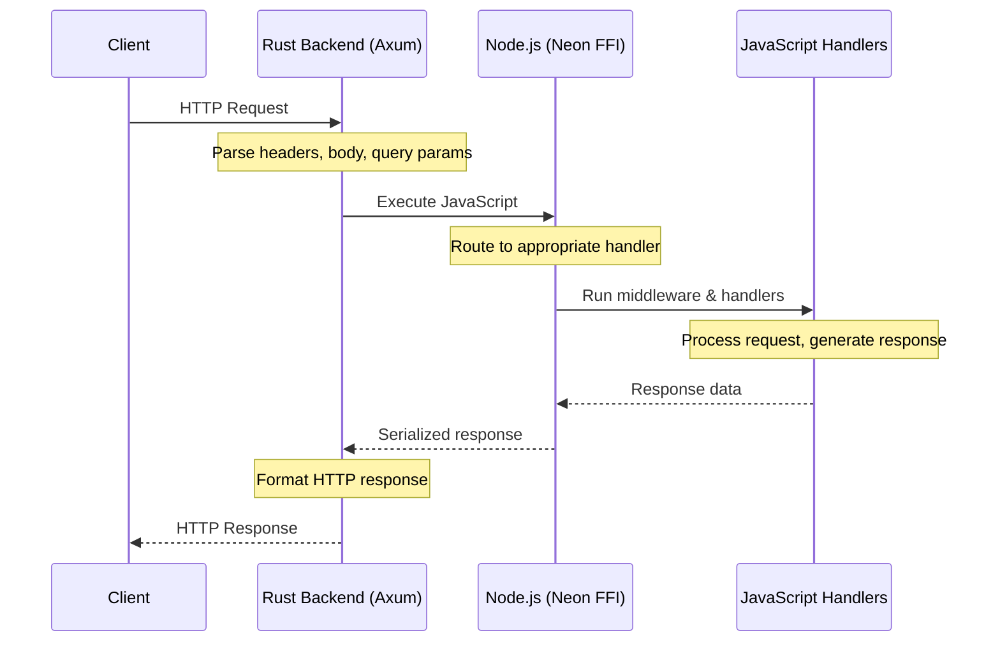
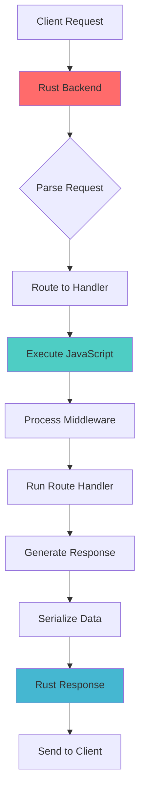
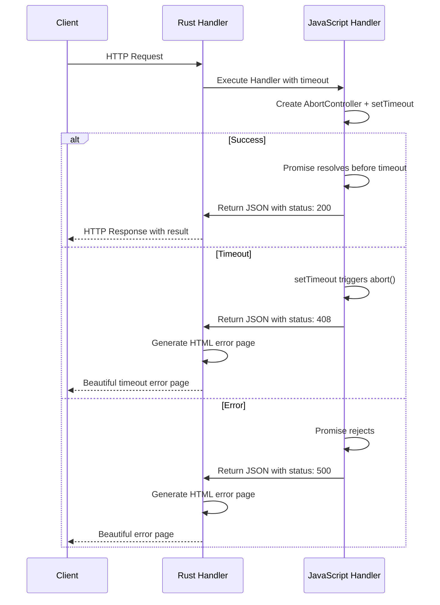

# Architecture Overview

## System Architecture

RNode Server uses a **unique hybrid approach** where **all JavaScript code execution happens through Rust backend**. This architecture provides both advantages and challenges.

## Request Flow

## Data Flow

## Core Components

### Rust Backend (Axum)
- **HTTP Server**: Handles all incoming HTTP requests
- **Request Parsing**: Parses headers, body, and query parameters
- **Routing**: Determines which JavaScript handler to execute
- **Response Generation**: Formats and sends HTTP responses

### Node.js Integration (Neon FFI)
- **JavaScript Execution**: Runs your Express-like code
- **Data Serialization**: Converts between Rust and JavaScript data types
- **Middleware Chain**: Executes middleware and route handlers
- **Response Processing**: Handles JSON, files, and custom responses

### Communication Layer
- **Zero-Copy**: Minimizes data copying between layers
- **Type Safety**: Maintains type safety across language boundaries
- **Error Handling**: Graceful error propagation between layers

## Promise Management System

RNode Server implements a **revolutionary promise management system** that eliminates polling and provides instant notification when promises complete.

### How It Works

### Key Features

- **🚀 Direct Promise Handling**: JavaScript promises are awaited directly in Rust using Neon FFI
- **⏱️ Built-in Timeout**: AbortController automatically cancels operations when timeout is reached
- **🔒 Status-based Errors**: All errors return proper HTTP status codes (4xx, 5xx)
- **🎨 Auto Error Pages**: Rust generates beautiful HTML error pages for error statuses
- **🧹 Memory Safe**: Automatic cleanup of timers and abort signals

## Advantages

- **🚀 Performance**: Rust handles HTTP parsing, routing, and response generation at native speed
- **🔒 Security**: Rust's memory safety prevents common server vulnerabilities
- **⚡ Efficiency**: Minimal overhead between HTTP layer and JavaScript execution
- **🔄 Control**: Full control over request/response lifecycle
- **🧩 Flexibility**: Can implement custom optimizations at any layer
- **⚡ Revolutionary Promise System**: No more polling - instant notification when promises complete
- **🧠 Smart State Management**: Uses Rust's conditional variables for efficient waiting
- **💾 Zero Memory Leaks**: Automatic promise cleanup from both Rust and JavaScript sides

## Challenges & Considerations

- **🔄 Complexity**: JavaScript execution requires FFI (Foreign Function Interface) calls
- **📊 Memory**: Data serialization between Rust and JavaScript layers
- **🔧 Debugging**: More complex debugging across language boundaries
- **📚 Learning Curve**: Requires understanding of both Rust and Node.js ecosystems

## What This Enables

- **🚀 Custom HTTP Optimizations**: Implement protocol-level improvements
- **🔒 Advanced Security**: Rust-level security checks before JavaScript execution
- **⚡ Performance Monitoring**: Detailed metrics at every layer
- **🧩 Protocol Extensions**: Custom HTTP methods, headers, and behaviors
- **🔄 Real-time Processing**: Low-latency data transformation between layers

## Performance Characteristics

| Metric                   | Express | RNode Server | Improvement |
|--------------------------|---------|--------------|-------------|
| **Requests/sec (RPS)**   | 9,315   | 25,378      | **~2.7× faster** |
| **Average time/request** | 10.7 ms | 3.9 ms      | **~2.7× faster** |
| **Transfer rate**        | 3.3 MB/s| 6.6 MB/s    | **~2× higher** |
| **Memory usage**         | Higher  | Lower       | **More efficient** |
| **CPU usage**            | Higher  | Lower       | **More efficient** |

## Use Cases

### High-Performance APIs
- **Microservices**: Fast request processing with minimal latency
- **Real-time Applications**: Low-latency data processing
- **High-Traffic Websites**: Efficient handling of concurrent requests

### Security-Critical Applications
- **Financial Services**: Rust-level security guarantees
- **Healthcare**: Memory-safe request processing
- **Government**: Secure data handling

### Resource-Constrained Environments
- **Edge Computing**: Efficient resource usage
- **IoT Applications**: Low memory footprint
- **Cloud Services**: Cost-effective scaling
