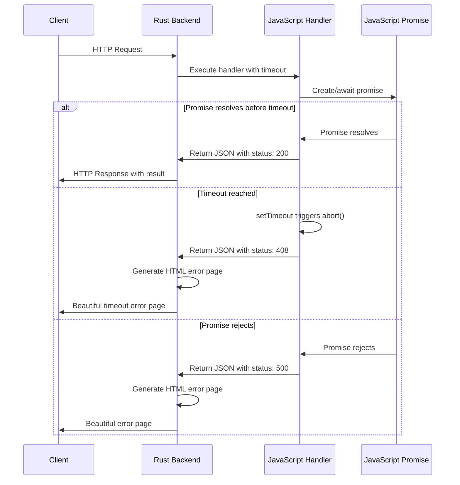

# Promise Management System

## Overview

RNode Server implements a revolutionary promise management system that eliminates polling and provides instant notification when promises complete.

## How It Works

### Core Concept
JavaScript promises are awaited directly in Rust using Neon FFI, with built-in timeout handling and automatic cleanup.

### Architecture Flow


## Key Features

### Direct Promise Handling
- JavaScript promises are awaited directly in Rust using Neon FFI
- No polling or busy waiting
- Zero CPU waste during promise execution

### Built-in Timeout
- AbortController automatically cancels operations when timeout is reached
- Configurable timeout per request
- Automatic cleanup of timers and abort signals

### Status-based Errors
- All errors return proper HTTP status codes (4xx, 5xx)
- Automatic error page generation for error statuses
- Beautiful HTML error pages with user-friendly messages

### Memory Safety
- Automatic cleanup of timers and abort signals
- No memory leaks from abandoned promises
- Rust-level memory management

## Technical Implementation

### Rust Side (handlers.rs)
```rust
// Execute JavaScript handler and await promise
let result = cx.execute_scoped(|mut cx| {
    let handler_fn = cx.global().get(&mut cx, "getHandler")?;
    let args = vec![cx.string(request_json), cx.number(timeout)];
    handler_fn.call(&mut cx, args)
})?;

// Parse JSON response and check status
if let Some(status) = response_json_value["status"].as_u64() {
    if status >= 400 {
        return crate::html_templates::generate_error_page(
            status_code, "Error", error_message, None, dev_mode
        );
    }
}
```

### JavaScript Side (handler-utils.ts)
```typescript
// Set timeout with AbortController
const timeoutId = setTimeout(() => {
  req.abortController?.abort();
}, timeout);

// Execute handler and await promise
const result = handler.handler(req, res);
if (result && typeof result.then === 'function') {
  const resolvedResult = await result;
  
  // Check if aborted due to timeout
  if (req.abortController?.signal.aborted) {
    return JSON.stringify({
      content: `Handler timeout after ${timeout}ms`,
      status: 408,
      error: 'timeout'
    });
  }
}
```

## Error Status Codes

### Success Responses
| Status | Description | When Used |
|--------|-------------|-----------|
| **200** | OK | Normal successful response |

### Client Errors (4xx)
| Status | Description | When Used |
|--------|-------------|-----------|
| **400** | Bad Request | Invalid input data |
| **401** | Unauthorized | Authentication required |
| **403** | Forbidden | Access denied |
| **404** | Not Found | Route not found |
| **408** | Request Timeout | Handler exceeded timeout |
| **429** | Too Many Requests | Rate limit exceeded |

### Server Errors (5xx)
| Status | Description | When Used |
|--------|-------------|-----------|
| **500** | Internal Server Error | Handler execution failed |
| **502** | Bad Gateway | Upstream service error |
| **503** | Service Unavailable | Service temporarily unavailable |
| **504** | Gateway Timeout | Upstream timeout |

## Code Examples

### Async Route Handlers with Timeout
```typescript
// Slow request with timeout handling
app.get('/api/slow', async (req, res) => {
  const delay = parseInt(req.query.delay as string) || 2000;
  const startTime = Date.now();
  
  try {
    // Simulate slow processing with abort support
    await req.sleep(delay);
    
    const executionTime = Date.now() - startTime;
    res.json({
      message: 'Slow request completed',
      delay: delay,
      executionTime: executionTime
    });
  } catch (error) {
    const executionTime = Date.now() - startTime;
    res.status(500).json({
      error: 'Slow request failed',
      executionTime: executionTime
    });
  }
});
```

### Async Middleware with Timeout Support
```typescript
// Auth middleware with timeout
app.use(async (req, res, next) => {
  try {
    const user = await validateToken(req.headers.authorization);
    req.user = user;
    next();
  } catch (error) {
    res.status(401).json({ error: 'Authentication failed' });
  }
});
```

### Database Operations with Timeout
```typescript
app.get('/api/users/{id}', async (req, res) => {
  try {
    const { id } = req.params;
    
    // Database query with timeout support
    const user = await Promise.race([
      findUserById(id),
      new Promise((_, reject) => 
        setTimeout(() => reject(new Error('Database timeout')), 5000)
      )
    ]);
    
    if (!user) {
      return res.status(404).json({ error: 'User not found' });
    }
    
    res.json({ success: true, user });
  } catch (error) {
    if (error.message === 'Database timeout') {
      res.status(408).json({ error: 'Database operation timed out' });
    } else {
      res.status(500).json({ error: 'Internal server error' });
    }
  }
});
```

### External API Calls with Timeout
```typescript
app.get('/api/external-data', async (req, res) => {
  try {
    // External API call with timeout
    const response = await Promise.race([
      fetch('https://api.external.com/data'),
      new Promise((_, reject) => 
        setTimeout(() => reject(new Error('External API timeout')), 10000)
      )
    ]);
    
    if (!response.ok) {
      throw new Error(`External API error: ${response.status}`);
    }
    
    const data = await response.json();
    res.json({ success: true, data });
  } catch (error) {
    if (error.message.includes('timeout')) {
      res.status(408).json({ error: 'External API timeout' });
    } else {
      res.status(502).json({ error: 'External API error' });
    }
  }
});
```

## Advanced Patterns

### Promise Pool Management
```typescript
class PromisePool {
  private pool: Set<Promise<any>> = new Set();
  private maxConcurrent: number;
  
  constructor(maxConcurrent: number = 10) {
    this.maxConcurrent = maxConcurrent;
  }
  
  async execute<T>(fn: () => Promise<T>): Promise<T> {
    // Wait if pool is full
    if (this.pool.size >= this.maxConcurrent) {
      await Promise.race(this.pool);
    }
    
    // Create promise and add to pool
    const promise = fn().finally(() => {
      this.pool.delete(promise);
    });
    
    this.pool.add(promise);
    return promise;
  }
  
  async waitForAll(): Promise<void> {
    await Promise.all(this.pool);
  }
}

// Usage in route handler
const promisePool = new PromisePool(5);

app.post('/api/batch-process', async (req, res) => {
  const { items } = req.body;
  
  try {
    const results = await Promise.all(
      items.map(item => 
        promisePool.execute(() => processItem(item))
      )
    );
    
    res.json({ success: true, results });
  } catch (error) {
    res.status(500).json({ error: 'Batch processing failed' });
  }
});
```

### Cancellable Operations
```typescript
app.get('/api/search', async (req, res) => {
  const { query, timeout = 5000 } = req.query;
  
  // Create abort controller for this request
  const abortController = new AbortController();
  const timeoutId = setTimeout(() => abortController.abort(), timeout);
  
  try {
    const results = await searchDatabase(query, {
      signal: abortController.signal
    });
    
    clearTimeout(timeoutId);
    res.json({ success: true, results });
  } catch (error) {
    clearTimeout(timeoutId);
    
    if (error.name === 'AbortError') {
      res.status(408).json({ error: 'Search operation timed out' });
    } else {
      res.status(500).json({ error: 'Search failed' });
    }
  }
});
```

### Retry Logic with Exponential Backoff
```typescript
async function retryWithBackoff<T>(
  fn: () => Promise<T>,
  maxRetries: number = 3,
  baseDelay: number = 1000
): Promise<T> {
  let lastError: Error;
  
  for (let attempt = 1; attempt <= maxRetries; attempt++) {
    try {
      return await fn();
    } catch (error) {
      lastError = error;
      
      if (attempt === maxRetries) {
        break;
      }
      
      // Don't retry on client errors (4xx)
      if (error.status >= 400 && error.status < 500) {
        break;
      }
      
      // Exponential backoff
      const delay = baseDelay * Math.pow(2, attempt - 1);
      await new Promise(resolve => setTimeout(resolve, delay));
    }
  }
  
  throw lastError;
}

// Usage in route handler
app.get('/api/resilient-data', async (req, res) => {
  try {
    const data = await retryWithBackoff(
      () => fetchExternalData(),
      3,  // max retries
      1000 // base delay
    );
    
    res.json({ success: true, data });
  } catch (error) {
    res.status(500).json({ error: 'Failed to fetch data after retries' });
  }
});
```

## Performance Benefits

### Zero CPU Waste
- No polling or busy waiting during promise execution
- Rust efficiently waits using conditional variables
- CPU resources available for other operations

### Instant Notification
- Immediate response when promises complete
- No delay from polling intervals
- Better user experience and responsiveness

### Memory Efficiency
- Automatic cleanup of abandoned promises
- No memory leaks from timer accumulation
- Efficient resource management

### Scalability
- Handles thousands of concurrent promises
- Minimal overhead per request
- Linear scaling with request volume

## Best Practices

### Set Appropriate Timeouts
```typescript
// Quick operations
app.get('/api/health', async (req, res) => {
  // 2 second timeout for health checks
  const result = await Promise.race([
    checkHealth(),
    new Promise((_, reject) => 
      setTimeout(() => reject(new Error('Health check timeout')), 2000)
    )
  ]);
  
  res.json({ status: 'healthy', result });
});

// Slow operations
app.post('/api/process-large-file', async (req, res) => {
  // 5 minute timeout for file processing
  const result = await Promise.race([
    processLargeFile(req.body),
    new Promise((_, reject) => 
      setTimeout(() => reject(new Error('File processing timeout')), 300000)
    )
  ]);
  
  res.json({ success: true, result });
});
```

### Handle Abort Signals
```typescript
app.get('/api/long-running-task', async (req, res) => {
  const abortController = new AbortController();
  
  try {
    const result = await longRunningTask({
      signal: abortController.signal
    });
    
    res.json({ success: true, result });
  } catch (error) {
    if (error.name === 'AbortError') {
      res.status(408).json({ error: 'Operation cancelled' });
    } else {
      res.status(500).json({ error: 'Operation failed' });
    }
  }
});
```

### Clean Up Resources
```typescript
app.get('/api/stream-data', async (req, res) => {
  const stream = createDataStream();
  const cleanup = () => {
    stream.destroy();
    // Clean up other resources
  };
  
  try {
    // Handle client disconnect
    req.on('close', cleanup);
    
    const data = await processStream(stream);
    res.json({ success: true, data });
  } catch (error) {
    cleanup();
    res.status(500).json({ error: 'Stream processing failed' });
  }
});
```

## Next Steps

- [System Design](./overview.md) - Complete architecture overview
- [API Reference](../api/) - Handler and middleware APIs
- [Examples](../examples/) - Practical usage examples
- [Monitoring](../monitoring/) - Performance monitoring
